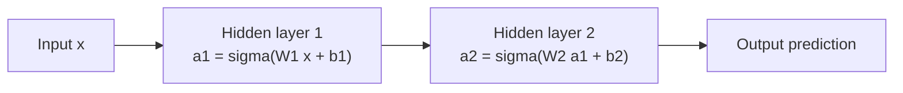
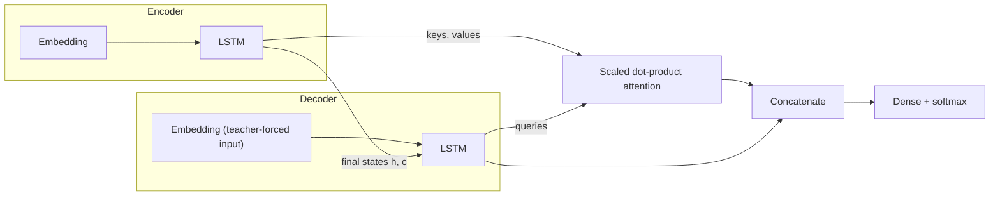
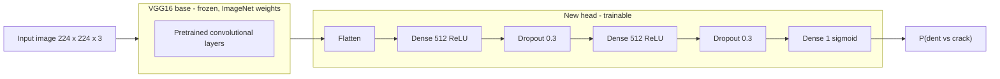

# Deep Learning and Neural Networks with Keras

[](https://github.com/Axeloooo/Deep-Learning-and-Neural-Networks-with-Keras/actions/workflows/release.yaml)
[](https://github.com/Axeloooo/Deep-Learning-and-Neural-Networks-with-Keras/tags)
[](https://github.com/Axeloooo/Deep-Learning-and-Neural-Networks-with-Keras/issues)
[](https://github.com/Axeloooo/Deep-Learning-and-Neural-Networks-with-Keras/pulls)
[](https://github.com/Axeloooo/Deep-Learning-and-Neural-Networks-with-Keras/graphs/contributors)
[](https://github.com/Axeloooo/Deep-Learning-and-Neural-Networks-with-Keras)
[](LICENSE)
[](https://www.conventionalcommits.org/)
[](https://colab.research.google.com/github/Axeloooo/Deep-Learning-and-Neural-Networks-with-Keras/blob/main/notebooks/forward-propagation.ipynb)

A self-contained primer on deep learning with Keras: eight notebooks that build neural networks from raw NumPy up to convolutional, attention-based, and transfer-learning models, each runnable in Google Colab in one click.

## 📄 Abstract

This repository collects eight Jupyter notebooks that develop deep learning from first principles to applied practice. The pedagogical arc proceeds in five stages: neural networks implemented by hand in NumPy (forward propagation, then backpropagation on the XOR problem), an analysis of activation functions and the vanishing gradient problem, supervised learning with the Keras `Sequential` API (regression on tabular data and classification on MNIST), convolutional networks that preserve spatial structure, and finally sequence-to-sequence modeling with attention and transfer learning with a frozen, pretrained VGG16 base alongside BLIP-based image captioning. This document serves two purposes: an onboarding path that opens every notebook directly in Google Colab, and a concept-ordered reference that explains and derives each idea independently of any particular notebook. It is written for readers with basic Python and calculus, new to neural networks. The notebooks are adapted from IBM Skills Network coursework.

## 📑 Table of Contents

- [Abstract](#-abstract)
- [Introduction](#-introduction)
- [Getting Started with Google Colab](#-getting-started-with-google-colab)
- [Core Concepts](#-core-concepts)
- [Conclusion](#-conclusion)
- [References](#-references)
- [License](#️-license)

## 🎯 Introduction

A neural network is best understood not as an imitation of the brain but as a stack of simple, differentiable functions. Each layer applies a linear transformation — a matrix multiplication plus a bias — followed by a nonlinear activation function. Stacked deeply enough, such layers can approximate remarkably complicated mappings from inputs to outputs: pixel intensities to digit labels, ingredient volumes to concrete strength, English phrases to Spanish ones. The entire field rests on two observations. First, composing many small differentiable pieces yields an expressive family of functions whose behavior is controlled by millions of adjustable weights. Second, because every piece is differentiable, calculus provides an exact, efficient recipe — backpropagation [1] — for computing how much each individual weight contributed to a prediction error, and therefore how to adjust it.

That second observation is what made deep learning practical. Before backpropagation was popularized, there was no scalable way to assign credit to weights buried in the middle of a network. With it, training reduces to a loop: run the network forward, measure the error with a loss function, run the chain rule backward to obtain a gradient, and take a small step downhill. Every technique covered here — from activation-function choice to attention — is either a component of that loop or a response to one of its failure modes [2].

The Core Concepts section below is ordered as a ladder, and the ordering is deliberate. It begins with a single artificial neuron and the reason nonlinearity matters, assembles neurons into layers and a forward pass, then introduces losses, gradients, and the backward pass that makes learning possible. It continues with the optimizers that consume those gradients and the vanishing-gradient pathology that constrains deep stacks. Only then does it move to Keras, where the same machinery is invoked through `compile` and `fit` rather than written by hand — first for regression, then classification, then convolutional networks, sequence models with attention, and transfer learning. The final entry condenses the Keras API itself into one page.

A reader starting from zero can follow this document top to bottom: each concept relies only on those before it, the visible prose carries the intuition, and the collapsed blocks hold the derivations and code. Reading the spine takes roughly fifteen minutes; the notebooks provide the hands-on counterpart.

## 🚀 Getting Started with Google Colab

The notebooks require no local setup; they run in Google Colab, a free, browser-based Jupyter environment:

1. Click an **Open in Colab** badge in the table below; the notebook opens directly in Colab from GitHub — no clone, no environment, no installation.
2. Select **Runtime > Run all**. Colab preinstalls `numpy`, `pandas`, `matplotlib`, `tensorflow`, `keras`, `torch`, and `transformers`, so there is nothing to install; the notebooks' own install cells are commented out on purpose.
3. Optionally, select **Runtime > Change runtime type > GPU**. A GPU is never required and makes a practical difference only for the last two notebooks; the first six train comfortably on the default CPU runtime.

The badges reference the `main` branch, so they resolve once this branch is merged.

| # | Notebook | Topic | Open |
|---|---|---|---|
| 1 | [`forward-propagation.ipynb`](notebooks/forward-propagation.ipynb) | Forward propagation from scratch with NumPy | [](https://colab.research.google.com/github/Axeloooo/Deep-Learning-and-Neural-Networks-with-Keras/blob/main/notebooks/forward-propagation.ipynb) |
| 2 | [`backward-propagation.ipynb`](notebooks/backward-propagation.ipynb) | Backpropagation from scratch on the XOR problem | [](https://colab.research.google.com/github/Axeloooo/Deep-Learning-and-Neural-Networks-with-Keras/blob/main/notebooks/backward-propagation.ipynb) |
| 3 | [`activation-functions-and-vanishing.ipynb`](notebooks/activation-functions-and-vanishing.ipynb) | Activation functions and vanishing gradients | [](https://colab.research.google.com/github/Axeloooo/Deep-Learning-and-Neural-Networks-with-Keras/blob/main/notebooks/activation-functions-and-vanishing.ipynb) |
| 4 | [`regression-with-keras.ipynb`](notebooks/regression-with-keras.ipynb) | Regression with Keras `Sequential` | [](https://colab.research.google.com/github/Axeloooo/Deep-Learning-and-Neural-Networks-with-Keras/blob/main/notebooks/regression-with-keras.ipynb) |
| 5 | [`classification-with-keras.ipynb`](notebooks/classification-with-keras.ipynb) | Classification on MNIST | [](https://colab.research.google.com/github/Axeloooo/Deep-Learning-and-Neural-Networks-with-Keras/blob/main/notebooks/classification-with-keras.ipynb) |
| 6 | [`convolutional-neural-networks-with-keras.ipynb`](notebooks/convolutional-neural-networks-with-keras.ipynb) | Convolutional neural networks on MNIST | [](https://colab.research.google.com/github/Axeloooo/Deep-Learning-and-Neural-Networks-with-Keras/blob/main/notebooks/convolutional-neural-networks-with-keras.ipynb) |
| 7 | [`transformers-with-Keras.ipynb`](notebooks/transformers-with-Keras.ipynb) | Seq2seq with LSTM and attention | [](https://colab.research.google.com/github/Axeloooo/Deep-Learning-and-Neural-Networks-with-Keras/blob/main/notebooks/transformers-with-Keras.ipynb) |
| 8 | [`classification-and-captioning.ipynb`](notebooks/classification-and-captioning.ipynb) | Transfer learning with VGG16 and BLIP captioning | [](https://colab.research.google.com/github/Axeloooo/Deep-Learning-and-Neural-Networks-with-Keras/blob/main/notebooks/classification-and-captioning.ipynb) |

## 🧠 Core Concepts

This section is organized by concept, not by notebook, so an idea can be revisited without reopening its source. Each entry states what a concept is and why it exists; the collapsed blocks hold derivations and code consistent with what the notebooks run.

### The Artificial Neuron

A neuron performs two operations. It first computes a **weighted sum**: each input is multiplied by a learned weight, the products are added, and a learned constant — the **bias** — is added on top. It then passes that single number through an activation function. The weights encode how strongly each input influences the neuron; they are what training adjusts.

The bias exists because a weighted sum without one is forced through the origin: if every input is zero, the output is zero, regardless of the weights. The bias lets the neuron shift its operating point — deciding, in effect, how large the weighted evidence must be before the activation responds.

$$z = \sum_i w_i x_i + b$$

<details>
<summary>💻 Code: one neuron in NumPy, as the first notebook writes it</summary>

The forward-propagation notebook computes a neuron exactly as the equation reads, then wraps the two steps in reusable functions:

```python
import numpy as np

def compute_weighted_sum(inputs, weights, bias):
    return np.sum(inputs * weights) + bias

def node_activation(weighted_sum):
    return 1.0 / (1.0 + np.exp(-1 * weighted_sum))

x_1, x_2 = 0.5, 0.85
z_11 = x_1 * weights[0] + x_2 * weights[1] + biases[0]   # weighted sum
a_11 = 1.0 / (1.0 + np.exp(-z_11))                        # sigmoid activation
```

`weights` and `biases` are drawn from `np.random.uniform` — untrained networks start from random parameters, which is why every run of the notebook prints different numbers.

</details>

### Activation Functions

The activation function is the nonlinearity applied to the weighted sum, and it is the reason depth means anything. A composition of purely linear layers collapses: two matrix multiplications in a row are algebraically a single matrix multiplication, so a hundred linear layers have exactly the expressive power of one. A nonlinearity between layers breaks that collapse and lets each additional layer genuinely enlarge the family of functions the network can represent.

Four activations cover the notebooks. **Sigmoid** squashes any real number into $(0,1)$, which suits probability-like outputs but flattens out — saturates — for large inputs. **Tanh** is its zero-centered relative with range $(-1,1)$, slightly better conditioned but equally prone to saturation. **ReLU**, $\max(0,z)$, is cheap and does not saturate for positive inputs, which is why it dominates hidden layers. **Softmax** normalizes a score vector into a probability distribution, used for multi-class output layers.

Because training multiplies activation *derivatives* across layers, the derivative of each function matters as much as its shape; the consequences are developed under [Vanishing and Exploding Gradients](#vanishing-and-exploding-gradients).

<details>
<summary>📐 Definitions and derivatives of sigmoid, tanh, ReLU, and softmax</summary>

$$\sigma(z) = \frac{1}{1+e^{-z}}, \qquad \sigma'(z) = \sigma(z)\,(1-\sigma(z))$$

The sigmoid derivative peaks at $0.25$ when $z=0$ and decays toward $0$ in both directions.

$$\tanh(z) = \frac{e^z - e^{-z}}{e^z + e^{-z}}, \qquad \tanh'(z) = 1 - \tanh(z)^2$$

Tanh's derivative peaks at $1$, four times sigmoid's maximum, but still vanishes as $|z|$ grows.

$$\text{ReLU}(z) = \max(0, z), \qquad \text{ReLU}'(z) = \begin{cases} 1 & z > 0 \\ 0 & z \le 0 \end{cases}$$

$$\text{softmax}(z)_i = \frac{e^{z_i}}{\sum_{k=1}^{K} e^{z_k}}$$

Softmax outputs are positive and sum to $1$, so they are directly interpretable as class probabilities.

</details>

<details>
<summary>💻 Code: the activation functions as the third notebook defines them</summary>

```python
def sigmoid(z):
    return 1 / (1 + np.exp(-z))

def sigmoid_derivative(z):
    return sigmoid(z) * (1 - sigmoid(z))

def relu(z):
    return np.maximum(0, z)

def relu_derivative(z):
    return np.where(z > 0, 1, 0)

def tanh(z):
    return np.tanh(z)

def tanh_derivative(z):
    return 1 - np.tanh(z) ** 2
```

The notebook evaluates these over `z = np.linspace(-10, 10, 400)` and plots function against derivative, making the saturation of sigmoid and the constant unit gradient of ReLU directly visible.

</details>

### Forward Propagation

Forward propagation is inference: data enters the input layer, and each successive layer computes its weighted sums and activations using the previous layer's outputs as inputs, until the output layer produces the prediction. Nothing is learned during a forward pass — no loss, no gradient — and isolating it cleanly separates *making* predictions from *improving* them; the forward pass is also the half that later gets differentiated.

At the level of a whole layer, the per-neuron weighted sums collapse into one matrix multiplication: stacking each neuron's weight vector as a row of $W$ gives $z = Wx + b$, followed by an elementwise activation; a network is then a short pipeline of such steps.



<details>
<summary>📐 Shape conventions: what multiplies what</summary>

For a layer with $n$ inputs and $m$ neurons, $W$ has shape $m \times n$ (one row per neuron), $x$ has shape $n \times 1$, and $z = Wx + b$ has shape $m \times 1$. Chaining layers works because each layer's $m$ becomes the next layer's $n$.

Batching follows the same rule. Placing $k$ examples as *columns* of an $n \times k$ matrix $X$ gives $Z = WX + b$ with shape $m \times k$ — every column is one example's weighted sums, and the bias broadcasts across columns. This examples-as-columns convention is exactly the one the backpropagation notebook adopts (its XOR input is a $2 \times 4$ matrix), and it is why the weight matrix always multiplies from the left there.

Keras uses the transposed convention — examples as rows, `(batch, features)` — which is why its `Dense` layers compute $XW^T + b$ internally and shape errors between the two conventions are a common source of confusion.

</details>

<details>
<summary>💻 Code: propagating through an arbitrary network</summary>

The first notebook generalizes the by-hand computation into a loop over layers, each layer's outputs feeding the next:

```python
def forward_propagate(network, inputs):
    layer_inputs = list(inputs)
    for layer in network:
        layer_outputs = []
        for layer_node in network[layer]:
            node_data = network[layer][layer_node]
            node_output = node_activation(
                compute_weighted_sum(layer_inputs, node_data['weights'], node_data['bias']))
            layer_outputs.append(np.around(node_output[0], decimals=4))
        layer_inputs = layer_outputs
    return layer_outputs
```

The `network` is a nested dictionary built by `initialize_network(num_inputs, num_hidden_layers, num_nodes_hidden, num_nodes_output)`, so the same function serves any architecture.

</details>

### Loss Functions

A loss function reduces "how wrong were the predictions" to a single differentiable number — the one scalar gradient-based training needs to differentiate. The choice of loss is not cosmetic: each loss encodes an assumption about the prediction task [2].

**Mean squared error** (MSE) suits regression. It penalizes the squared distance between prediction and target, which assumes the target is a continuous quantity where being off by 2 is four times as bad as being off by 1. **Categorical cross-entropy** suits classification. It compares a predicted probability distribution against a one-hot target and penalizes the model for assigning low probability to the true class; it assumes the output layer produces a valid distribution, which is why it is paired with softmax. Using MSE for classification is possible but trains poorly: cross-entropy's gradient stays large while the model is confidently wrong, exactly when learning pressure is most needed.

<details>
<summary>📐 The two losses, and what each assumes</summary>

Mean squared error over $n$ examples with predictions $\hat y_i$ and targets $y_i$:

$$\text{MSE} = \frac{1}{n}\sum_{i=1}^{n} (y_i - \hat y_i)^2$$

Squaring makes the loss smooth, always positive, and increasingly punishing for large errors; it corresponds to assuming Gaussian noise around a true continuous value.

Categorical cross-entropy for one example with $K$ classes, one-hot target $y$, and predicted distribution $\hat y$:

$$\text{CE} = -\sum_{i=1}^{K} y_i \log(\hat y_i)$$

Only the true class's term is nonzero, so the loss is simply $-\log \hat y_{\text{true}}$: it approaches $0$ as the model grows confident in the right class and grows without bound as the model grows confident in a wrong one. The binary special case, used by the capstone's dent-versus-crack classifier, is $\text{BCE} = -[\,y\log \hat y + (1-y)\log(1-\hat y)\,]$ with a single sigmoid output.

</details>

### Gradients and the Chain Rule

A gradient collects the partial derivatives of the loss with respect to every weight: for each weight, "if this weight increased slightly, how would the loss change?" That vector points in the direction of steepest loss increase, so stepping against it is the locally fastest way to reduce error. Training reduces to obtaining this gradient cheaply.

The obstacle is that a deep network is a composition of functions — the loss depends on the output activation, which depends on its weighted sum, which depends on the previous layer's activations, and so on. The **chain rule** resolves the composition: the derivative through nested functions is the product of each function's local derivative.

The useful mental picture is sensitivities flowing backward: each layer receives the loss's sensitivity to its output, rescales it through its own local derivative, and passes the sensitivity to its *input* down to its predecessor — which is precisely how backpropagation is organized.

<details>
<summary>📐 The Jacobian intuition, made concrete</summary>

For vector-valued layers the local derivative is a **Jacobian**: layer $f$ mapping $\mathbb{R}^n \to \mathbb{R}^m$ has an $m \times n$ matrix $J_f$ whose entry $(i,j)$ is $\partial f_i / \partial x_j$. The chain rule for a composition $L(f(g(x)))$ is a product of Jacobians:

$$\frac{\partial L}{\partial x} = \frac{\partial L}{\partial f}\, J_f\, J_g$$

Backpropagation never materializes these matrices. It computes vector–Jacobian products, and for the layers used here they take simple forms. For an elementwise activation, the Jacobian is diagonal, so the product is an elementwise multiplication by the activation derivative ($\odot$ below). For a linear layer $z = Wx$, the Jacobian with respect to $x$ is $W$ itself, so the backward pass multiplies by $W^T$:

$$\frac{\partial L}{\partial x} = W^T \frac{\partial L}{\partial z}, \qquad \frac{\partial L}{\partial a} \big/ \frac{\partial L}{\partial z} = \sigma'(z) \odot (\cdot)$$

These two rules — transpose-multiply through weights, elementwise-multiply through activations — are the entire mechanical content of the next section's derivation.

</details>

### Backward Propagation

Backpropagation is the chain rule organized as an algorithm [1]. After a forward pass, the error at the output is known; the backward pass walks the network in reverse, converting that error into a gradient for every weight and bias in one sweep. Its efficiency is the point: rather than perturbing every weight separately to see how the loss responds, one forward and one backward pass yield every partial derivative at once.

The XOR problem makes the need concrete. XOR's positive and negative examples cannot be separated by any straight line, so no single layer of weights can represent it; a hidden layer with a nonlinearity can. But a hidden layer's weights sit behind another layer — exactly the credit-assignment problem backpropagation solves. The notebook trains a 2–2–1 sigmoid network on XOR with nothing but NumPy.

<details>
<summary>📐 Derivation: the chain rule through a two-layer network</summary>

Forward pass, with examples as columns of $X$ and sigmoid activations:

$$z_1 = W_1 X + b_1, \quad a_1 = \sigma(z_1), \qquad z_2 = W_2 a_1 + b_2, \quad a_2 = \sigma(z_2)$$

Output error against targets $d$, then the chain rule through the output activation ($\odot$ is elementwise):

$$e = d - a_2, \qquad dz_2 = e \odot a_2 \odot (1 - a_2)$$

The second factor is $\sigma'(z_2) = \sigma(z_2)(1-\sigma(z_2))$ — the loss signal rescaled through the output layer's local derivative. Propagating to the hidden layer multiplies by $W_2^T$ (the transpose, because sensitivities flow backward through the linear map) and again through the local derivative:

$$da_1 = W_2^T dz_2, \qquad dz_1 = da_1 \odot a_1 \odot (1 - a_1)$$

Each layer's weight gradient is its incoming signal times its input, summed over the batch; with learning rate $lr$, the updates are:

$$W_2 \mathrel{+}= lr\,(dz_2\, a_1^T), \quad b_2 \mathrel{+}= lr \textstyle\sum dz_2, \qquad W_1 \mathrel{+}= lr\,(dz_1\, X^T), \quad b_1 \mathrel{+}= lr \textstyle\sum dz_1$$

</details>

<details>
<summary>💻 Code: the full training step in NumPy</summary>

This is the backpropagation notebook's loop. Note its data layout: `X` is a $2 \times 4$ matrix whose *columns* are the four XOR examples — which is why weight matrices multiply from the left and why every `np.dot` is ordered as written.

```python
X = np.array([[0, 0], [0, 1], [1, 0], [1, 1]]).T  # 2x4, each column one example
d = np.array([0, 1, 1, 0])

for epoch in range(epochs):
    # Forward pass
    z1 = np.dot(w1, X) + b1
    a1 = 1 / (1 + np.exp(-z1))
    z2 = np.dot(w2, a1) + b2
    a2 = 1 / (1 + np.exp(-z2))

    # Backward pass
    error = d - a2
    dz2 = error * (a2 * (1 - a2))
    da1 = np.dot(w2.T, dz2)
    dz1 = da1 * (a1 * (1 - a1))

    # Updates
    w2 += lr * np.dot(dz2, a1.T)
    b2 += lr * np.sum(dz2, axis=1, keepdims=True)
    w1 += lr * np.dot(dz1, X.T)
    b1 += lr * np.sum(dz1, axis=1, keepdims=True)
```

</details>

### Gradient Descent and Optimizers

Gradient descent turns gradients into learning: repeatedly nudge every weight a small step against its gradient. The step size is the **learning rate**, and it is the single most consequential hyperparameter — too large and training overshoots minima or diverges; too small and it crawls, or stalls in flat regions. The XOR notebook's pairing of `lr = 0.1` with 180,000 epochs shows the trade: cheap steps, but many of them.

In practice the gradient is estimated on a **batch** of examples rather than the full dataset — one weight update per batch, one **epoch** per full pass over the training set. Small batches give noisy but frequent updates; large batches, stable but expensive ones. This is stochastic gradient descent (SGD).

Modern optimizers refine the step, not the principle. **Adam** [3] keeps running averages of each weight's gradient and squared gradient, giving every weight its own adaptive, momentum-smoothed step size. It converges reliably with default settings, which is why every Keras notebook here compiles with `optimizer='adam'`.

<details>
<summary>📐 From SGD to Adam in four equations</summary>

Plain SGD updates each weight $w$ with learning rate $\eta$:

$$w \leftarrow w - \eta\, \nabla_w L$$

Adam maintains exponential moving averages of the gradient $g_t$ and its square, with decay rates $\beta_1, \beta_2$ (defaults $0.9$ and $0.999$):

$$m_t = \beta_1 m_{t-1} + (1-\beta_1) g_t, \qquad v_t = \beta_2 v_{t-1} + (1-\beta_2) g_t^2$$

After bias-correcting both averages ($\hat m_t = m_t/(1-\beta_1^t)$, $\hat v_t = v_t/(1-\beta_2^t)$), the update scales each weight's step by its own gradient history:

$$w \leftarrow w - \eta\, \frac{\hat m_t}{\sqrt{\hat v_t} + \epsilon}$$

The $m$ term is momentum, smoothing noisy batch gradients; the $\sqrt{\hat v}$ denominator shrinks steps for weights with large, volatile gradients and enlarges them for weights with small, consistent ones [3].

</details>

### Vanishing and Exploding Gradients

Backpropagation multiplies local derivatives across layers, and long products of numbers are unstable. If the factors are mostly below one, the product shrinks geometrically toward zero — the **vanishing gradient** problem; if above one, it grows without bound — the exploding variant. Saturating activations make vanishing the default: sigmoid's derivative never exceeds $0.25$, so ten sigmoid layers scale the earliest layers' gradients by at most $0.25^{10} \approx 10^{-6}$. Those early layers effectively stop learning — for years this capped trainable depth.

ReLU is the standard remedy: its derivative is exactly $1$ for positive inputs, so gradients pass through active units unshrunk regardless of depth. The cost is the **dead neuron** — a unit whose weighted sum is negative for every input outputs zero, receives zero gradient, and can never recover.

The other half of the remedy is initialization. Glorot initialization [4] scales random initial weights so signal variance is preserved layer to layer for symmetric activations; He initialization [5] adapts the scale for ReLU, whose zeroed half would otherwise halve the variance at every layer.

<details>
<summary>📐 Why the product shrinks, and the two initialization scales</summary>

The gradient reaching layer $\ell$ of an $L$-layer network contains one factor per traversed layer:

$$\frac{\partial L}{\partial a_\ell} = \left[\prod_{k=\ell+1}^{L} W_k^T\, \text{diag}\big(\sigma'(z_k)\big)\right] \frac{\partial L}{\partial a_L}$$

With $\sigma'(z) \le 0.25$ for sigmoid, each factor contracts the signal unless the weights are large — and large weights instead push activations into saturation, shrinking $\sigma'$ further. Depth converts a mild per-layer contraction into an exponential one.

Initialization controls the $W_k$ factors at the start of training. For a layer with $n_{\text{in}}$ inputs and $n_{\text{out}}$ outputs:

$$\text{Glorot:}\; \operatorname{Var}(w) = \frac{2}{n_{\text{in}} + n_{\text{out}}} \qquad \text{He:}\; \operatorname{Var}(w) = \frac{2}{n_{\text{in}}}$$

Glorot balances forward and backward signal variance for activations symmetric about zero [4]; He doubles the forward scale to compensate for ReLU discarding half of each pre-activation distribution [5]. Keras's `Dense` defaults to `glorot_uniform`, and the attention notebook's practice exercise swaps in `he_uniform` to compare.

</details>

### Regression with Keras

Everything implemented by hand above — weighted sums, activations, gradients, updates — is what Keras executes internally when a model is compiled and fit. The regression notebook applies this to predicting concrete compressive strength from eight numeric features: a `Sequential` stack of `Dense` layers — the API built for exactly this linear-pipeline case — trained with MSE and Adam in a few lines.

Two modeling choices carry the lesson. The output layer is `Dense(1)` with **no activation**: a regression target is an unbounded continuous quantity, so the raw weighted sum is the prediction, and squashing it through sigmoid would confine outputs to $(0,1)$. And the input features are **z-score normalized** — each column centered and scaled by its own statistics — because gradient descent converges poorly when features live on wildly different scales: a feature in the thousands otherwise dominates the loss surface and forces a learning rate that suits no feature well.

<details>
<summary>💻 Code: the regression model as the notebook builds it</summary>

```python
predictors_norm = (predictors - predictors.mean()) / predictors.std()
n_cols = predictors_norm.shape[1]

from keras.models import Sequential
from keras.layers import Dense
from keras.layers import Input

def regression_model():
    model = Sequential()
    model.add(Input(shape=(n_cols,)))
    model.add(Dense(50, activation='relu'))
    model.add(Dense(50, activation='relu'))
    model.add(Dense(1))                       # linear output for regression
    model.compile(optimizer='adam', loss='mean_squared_error')
    return model

model = regression_model()
model.fit(predictors_norm, target, validation_split=0.3, epochs=100, verbose=2)
```

`validation_split=0.3` holds out 30% of the data each epoch, so training and validation loss can be compared to judge overfitting.

</details>

### Classification with Keras

Classification changes the output contract: instead of one continuous value, the network must produce a probability distribution over classes. On MNIST [6] — 60,000 training and 10,000 test images of handwritten digits, each $28 \times 28$ grayscale — the model ends in `Dense(10, activation='softmax')`, ten probabilities summing to one, trained with categorical cross-entropy.

Two preprocessing steps make the data fit that contract. Each image is flattened to a 784-element vector, because a `Dense` layer has no concept of spatial arrangement — it consumes a flat list of numbers (what this discards is taken up by [Convolutional Neural Networks](#convolutional-neural-networks)). And the integer labels 0–9 are **one-hot encoded** into 10-element vectors, because cross-entropy compares two distributions: the model's softmax output and a target distribution putting all mass on the true class.

**Accuracy and loss measure different things.** Accuracy is the fraction of correct argmax predictions; loss also rewards confident, calibrated probabilities. Loss can improve while accuracy is flat, and rising validation loss under stable accuracy is an early overfitting signal.

<details>
<summary>💻 Code: MNIST preparation and the classifier</summary>

```python
from keras.datasets import mnist
from keras.utils import to_categorical

(X_train, y_train), (X_test, y_test) = mnist.load_data()

num_pixels = X_train.shape[1] * X_train.shape[2]          # 784
X_train = X_train.reshape(X_train.shape[0], num_pixels).astype('float32') / 255
X_test = X_test.reshape(X_test.shape[0], num_pixels).astype('float32') / 255

y_train = to_categorical(y_train)                          # one-hot targets
y_test = to_categorical(y_test)
num_classes = y_test.shape[1]

def classification_model():
    model = Sequential()
    model.add(Input(shape=(num_pixels,)))
    model.add(Dense(num_pixels, activation='relu'))
    model.add(Dense(100, activation='relu'))
    model.add(Dense(num_classes, activation='softmax'))
    model.compile(optimizer='adam', loss='categorical_crossentropy', metrics=['accuracy'])
    return model
```

The notebook also persists the trained model with `model.save('classification_model.keras')` and restores it with `keras.saving.load_model`, then continues training the reloaded model as a warm start.

</details>

### Convolutional Neural Networks

Flattening an image discards structure: nothing in a 784-element vector records that two pixels were adjacent, so a `Dense` network must relearn any pattern at every new position. Convolutional layers exist to keep and exploit that spatial structure [6]. A `Conv2D` filter is a small learned weight grid — $5 \times 5$ in the notebook — slid across the image, computing a weighted sum at every position and producing a **feature map** that lights up wherever its local pattern appears. Because one filter's weights are reused at every position (**parameter sharing**), a pattern learned anywhere is recognized everywhere, with a tiny fraction of a dense layer's parameters.

`MaxPooling2D` then downsamples each feature map by keeping only the maximum in each window, shrinking computation while preserving the strongest evidence and adding tolerance to small translations. Stacking a second convolution–pooling block lets later filters compose the first block's edges into corners and curves; only after this spatial processing does a final `Flatten` feed a `Dense` softmax head. The notebook builds one- and two-block variants on MNIST and compares them.

<details>
<summary>📐 Output-size arithmetic: kernels, stride, and padding</summary>

For an $n \times n$ input, filter size $f$, stride $s$, and padding $p$:

$$\text{output size} = \left\lfloor \frac{n - f + 2p}{s} \right\rfloor + 1$$

The notebook's first layer — $28 \times 28$ input, $5 \times 5$ filters, stride 1, no padding — yields $\lfloor(28-5)/1\rfloor + 1 = 24$, so 16 filters produce 16 feature maps of $24 \times 24$. The $2 \times 2$ pooling with stride 2 halves that to $12 \times 12$. Stride trades resolution for speed by skipping positions; padding ($p > 0$) preserves border information and output size.

Parameter sharing is visible in the counts: that `Conv2D(16, (5, 5))` layer has $16 \times (5 \cdot 5 \cdot 1) + 16 = 416$ parameters, against the 615,440 of the dense notebook's first `Dense(784)` layer.

</details>

<details>
<summary>💻 Code: the two-block CNN</summary>

```python
from keras.layers import Conv2D, MaxPooling2D, Flatten

X_train = X_train.reshape(X_train.shape[0], 28, 28, 1).astype('float32') / 255

def convolutional_model():
    model = Sequential()
    model.add(Input(shape=(28, 28, 1)))
    model.add(Conv2D(16, (5, 5), activation='relu'))
    model.add(MaxPooling2D(pool_size=(2, 2), strides=(2, 2)))
    model.add(Conv2D(8, (2, 2), activation='relu'))
    model.add(MaxPooling2D(pool_size=(2, 2), strides=(2, 2)))
    model.add(Flatten())
    model.add(Dense(100, activation='relu'))
    model.add(Dense(num_classes, activation='softmax'))
    model.compile(optimizer='adam', loss='categorical_crossentropy', metrics=['accuracy'])
    return model
```

Input must be 4-D — `(samples, 28, 28, 1)` with an explicit channel dimension — and `Flatten` appears only after the convolutional stages, once spatial processing is complete.

</details>

### Sequence Models and Attention

Sequences break the fixed-size assumption of everything above: input and output lengths vary, and order carries meaning. The **encoder–decoder** architecture handles this with two LSTMs: the encoder reads the source sentence and summarizes it into its final hidden state; the decoder starts from that state and emits the target one token at a time. During training the decoder uses **teacher forcing** — it is fed the *true* previous target word rather than its own possibly wrong prediction — so one early mistake cannot cascade through the sequence.

A single fixed-size summary vector is a bottleneck: everything about the source must squeeze through it. **Attention** removes it by letting the decoder, at every output step, look back across *all* encoder states and take a relevance-weighted blend of them [7], with relevance computed by scaled dot-product attention over learned query, key, and value projections.

A caveat: the notebook's layer is named `SelfAttention`, but its queries come from the decoder while its keys and values come from the encoder, which is **cross-attention**; self-attention proper — the transformer's core operation — draws all three from one sequence.



<details>
<summary>📐 Scaled dot-product attention, term by term</summary>

For query matrix $Q$, key matrix $K$, value matrix $V$, with key dimension $d_k$:

$$\text{Attention}(Q, K, V) = \text{softmax}\!\left(\frac{QK^T}{\sqrt{d_k}}\right) V$$

$QK^T$ scores every query against every key — a higher dot product means better alignment between what a decoder position is looking for and what an encoder position offers. Dividing by $\sqrt{d_k}$ keeps the scores' variance independent of dimensionality; without it, large $d_k$ pushes softmax toward a near-one-hot output whose gradients are almost zero [7]. Softmax converts each query's scores into weights summing to one, and multiplying by $V$ returns each query's weighted blend of value vectors.

</details>

<details>
<summary>💻 Code: the attention computation inside the custom layer</summary>

The notebook implements the formula in a custom Keras `Layer` whose `build` method creates trainable projections `Wq`, `Wk`, `Wv`, and whose `call` applies them (imports follow the notebook's own `tensorflow.keras` style):

```python
from tensorflow.keras import backend as K

def call(self, inputs):
    q, k, v = inputs                      # [decoder states, encoder states, encoder states]
    q = K.dot(q, self.Wq)
    k = K.dot(k, self.Wk)
    v = K.dot(v, self.Wv)

    scores = K.batch_dot(q, k, axes=[2, 2])          # QK^T per batch element
    dk = K.cast(K.shape(k)[-1], dtype=K.floatx())
    scores = scores / K.sqrt(dk)                      # scale by sqrt(d_k)

    attention_weights = K.softmax(scores, axis=-1)
    return K.batch_dot(attention_weights, v)          # weighted blend of values
```

The model trains on a five-pair English–Spanish phrase list for 100 epochs — a deliberately toy-scale demonstration of the mechanism, not a usable translator.

</details>

### Transfer Learning

Training a competitive image model from scratch requires data and computation that small tasks do not have. **Transfer learning** instead reuses a model pretrained on a large dataset as a feature extractor: the capstone loads VGG16 [8], pretrained on ImageNet, with `include_top=False` to discard its 1000-class head, and **freezes** every base layer so the pretrained convolutional features are used unchanged. Only a small new head — dense layers ending in one sigmoid unit — is trained to classify aircraft damage as a dent or a crack.

Freezing serves two purposes: it prevents the small dataset from destroying general-purpose features learned from over a million images, and it shrinks the trainable parameter count to what a few hundred images can fit without severe overfitting. The head is trained with a deliberately low Adam learning rate (`0.0001`): with few parameters and informative frozen features, large steps risk overshooting more than they help.

The capstone's second half applies the same reuse philosophy to a generative model: BLIP [9], a pretrained vision–language transformer, produces captions and longer summaries for the same images purely by changing its text prompt — no retraining — wrapped into the TensorFlow pipeline via `tf.py_function` [10].



<details>
<summary>💻 Code: freezing the base and training only the head</summary>

```python
from keras.applications import VGG16
from keras.optimizers import Adam

base_model = VGG16(weights='imagenet', include_top=False,
                   input_shape=(img_rows, img_cols, 3))

output = base_model.layers[-1].output
output = keras.layers.Flatten()(output)
base_model = Model(base_model.input, output)

for layer in base_model.layers:          # freeze: ImageNet features stay fixed
    layer.trainable = False

model = Sequential()
model.add(base_model)
model.add(Dense(512, activation='relu'))
model.add(Dropout(0.3))
model.add(Dense(512, activation='relu'))
model.add(Dropout(0.3))
model.add(Dense(1, activation='sigmoid'))

model.compile(optimizer=Adam(learning_rate=0.0001),
              loss='binary_crossentropy', metrics=['accuracy'])
```

Images stream from labeled directories through `ImageDataGenerator(rescale=1./255)` and `flow_from_directory(..., class_mode='binary')`.

</details>

<details>
<summary>💻 Code: prompt-conditioned captioning with BLIP</summary>

The BLIP model and processor load from Hugging Face; the task is selected by prompt alone:

```python
from transformers import BlipProcessor, BlipForConditionalGeneration

processor = BlipProcessor.from_pretrained("Salesforce/blip-image-captioning-base")
model = BlipForConditionalGeneration.from_pretrained("Salesforce/blip-image-captioning-base")

if task == "caption":
    prompt = "This is a picture of"
else:
    prompt = "This is a detailed photo showing"

inputs = processor(images=image, text=prompt, return_tensors="pt")
output = model.generate(**inputs)
result = processor.decode(output[0], skip_special_tokens=True)
```

BLIP runs in PyTorch; the notebook wraps this call in a custom `tf.keras.layers.Layer` using `tf.py_function`, which lets a TensorFlow graph invoke arbitrary Python — here, a PyTorch model — at execution time.

</details>

### The Keras API in One Page

Keras structures model-building as a progression of three levels, each trading convenience for flexibility. `Sequential` covers linear stacks — every regression, classification, and CNN model above. The functional `Model` API covers arbitrary directed graphs of layers — the encoder–decoder needs it, since two inputs and an attention branch cannot be expressed as a stack. Custom `Layer` subclasses cover new *operations*: when no built-in layer computes what is needed (scaled dot-product attention, a wrapped PyTorch model), one implements `build` to create trainable weights and `call` to define the computation.

Around any of the three, the lifecycle is uniform: `compile` attaches optimizer, loss, and metrics; `fit` runs the forward–backward–update loop; `evaluate` measures on held-out data; `predict` runs forward passes alone. The division of labor is the summary of this whole document — everything derived by hand in the early sections lives inside `fit`.

<details>
<summary>📊 The lifecycle methods and what each consumes</summary>

| Method | Purpose | Key arguments seen in the notebooks |
|---|---|---|
| `compile` | Configure training | `optimizer='adam'`, `loss='mean_squared_error'` / `'categorical_crossentropy'` / `'binary_crossentropy'`, `metrics=['accuracy']` |
| `fit` | Train; returns a `history` of per-epoch metrics | `epochs`, `batch_size`, `validation_split` or `validation_data`, `verbose=2` |
| `evaluate` | Score on held-out data | test arrays or a generator; returns `[loss, *metrics]` |
| `predict` | Forward pass only | inputs; returns raw outputs (probabilities, values) |
| `save` / `keras.saving.load_model` | Persist and restore a full model | a `.keras` file path |

</details>

<details>
<summary>💻 Code: the three levels side by side</summary>

```python
# 1. Sequential: a linear stack
model = Sequential()
model.add(Input(shape=(n_cols,)))
model.add(Dense(50, activation='relu'))
model.add(Dense(1))

# 2. Functional Model: an arbitrary graph (two inputs, shared state)
encoder_outputs, state_h, state_c = encoder_lstm(encoder_embedding)
decoder_outputs, _, _ = decoder_lstm(decoder_embedding,
                                     initial_state=[state_h, state_c])
model = Model([encoder_inputs, decoder_inputs], decoder_outputs)

# 3. Custom Layer: a new operation with its own weights
class SelfAttention(Layer):
    def build(self, input_shape):
        feature_dim = input_shape[0][-1]
        self.Wq = self.add_weight(shape=(feature_dim, feature_dim),
                                  initializer='glorot_uniform', trainable=True,
                                  name='Wq')
        ...
    def call(self, inputs):
        ...
```

The notebooks intentionally mix `keras.*` and `tensorflow.keras.*` import styles, sometimes in one file; both resolve to compatible implementations, and the repository preserves each notebook's original style [11] [12].

</details>

## 🏁 Conclusion

A reader who has worked through this document and its notebooks can do several concrete things: compute a forward pass by hand and explain each shape; derive and implement backpropagation for a small sigmoid network in NumPy; justify the standard activation–loss pairings for regression and classification; explain why deep sigmoid stacks stall and what ReLU and He initialization change; build, train, and evaluate `Sequential` models for tabular and image data; explain what convolution and pooling preserve that flattening destroys; trace how attention relieves the encoder–decoder bottleneck; and assemble a transfer-learning classifier from a frozen pretrained base.

The limits are equally concrete. The eight notebooks demonstrate mechanisms at teaching scale, not engineering practice: the attention model trains on five sentence pairs, hyperparameters are given rather than searched, and regularization appears only as capstone dropout. Full transformer architectures — self-attention proper, multi-head attention, positional encoding — are described but never built. Data augmentation, batch normalization, learning-rate schedules, and modern convolutional and generative architectures are absent entirely.

Natural next steps follow from those gaps: implement a small transformer encoder from the attention building blocks covered here [7]; replace the frozen-base recipe with staged fine-tuning; and rework the MNIST models with augmentation and normalization on a harder dataset. The textbook treatment in Goodfellow, Bengio, and Courville [2] deepens every derivation sketched above, and the Keras documentation [11] is the reference for every API the notebooks touch.

## 📚 References

1. Rumelhart, D. E., Hinton, G. E., & Williams, R. J. (1986). Learning representations by back-propagating errors. *Nature*, 323, 533–536. [https://www.nature.com/articles/323533a0](https://www.nature.com/articles/323533a0)
2. Goodfellow, I., Bengio, Y., & Courville, A. (2016). *Deep Learning*. MIT Press. [https://www.deeplearningbook.org/](https://www.deeplearningbook.org/)
3. Kingma, D. P., & Ba, J. (2015). Adam: A method for stochastic optimization. *ICLR 2015*, arXiv:1412.6980. [https://arxiv.org/abs/1412.6980](https://arxiv.org/abs/1412.6980)
4. Glorot, X., & Bengio, Y. (2010). Understanding the difficulty of training deep feedforward neural networks. *Proceedings of AISTATS 2010*, PMLR 9:249–256. [https://proceedings.mlr.press/v9/glorot10a.html](https://proceedings.mlr.press/v9/glorot10a.html)
5. He, K., Zhang, X., Ren, S., & Sun, J. (2015). Delving deep into rectifiers: Surpassing human-level performance on ImageNet classification. *ICCV 2015*, arXiv:1502.01852. [https://arxiv.org/abs/1502.01852](https://arxiv.org/abs/1502.01852)
6. LeCun, Y., Bottou, L., Bengio, Y., & Haffner, P. (1998). Gradient-based learning applied to document recognition. *Proceedings of the IEEE*, 86(11), 2278–2324. [https://ieeexplore.ieee.org/document/726791](https://ieeexplore.ieee.org/document/726791)
7. Vaswani, A., Shazeer, N., Parmar, N., Uszkoreit, J., Jones, L., Gomez, A. N., Kaiser, Ł., & Polosukhin, I. (2017). Attention is all you need. *NeurIPS 2017*, arXiv:1706.03762. [https://arxiv.org/abs/1706.03762](https://arxiv.org/abs/1706.03762)
8. Simonyan, K., & Zisserman, A. (2015). Very deep convolutional networks for large-scale image recognition. *ICLR 2015*, arXiv:1409.1556. [https://arxiv.org/abs/1409.1556](https://arxiv.org/abs/1409.1556)
9. Li, J., Li, D., Xiong, C., & Hoi, S. (2022). BLIP: Bootstrapping language-image pre-training for unified vision-language understanding and generation. *ICML 2022*, arXiv:2201.12086. [https://arxiv.org/abs/2201.12086](https://arxiv.org/abs/2201.12086)
10. Hugging Face Transformers documentation. [https://huggingface.co/docs/transformers/index](https://huggingface.co/docs/transformers/index)
11. Keras documentation. [https://keras.io/](https://keras.io/)
12. TensorFlow API documentation. [https://www.tensorflow.org/api_docs](https://www.tensorflow.org/api_docs)

## ⚖️ License

MIT — see [LICENSE](LICENSE).
